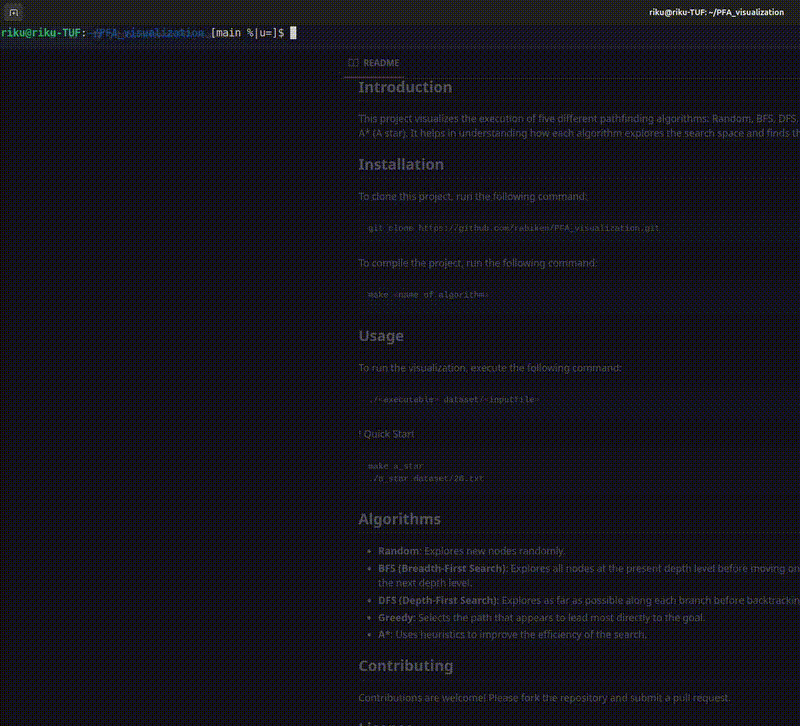

# PFA_visualization
Visualization of 5 different algorithms (Random, BFS, DFS, Greedy, A*(A star) )

## Demo
Here is a short demo of the A* algorithm in action:


- [Introduction](#introduction)
- [Installation](#installation)
- [Usage](#usage)
- [Algorithms](#algorithms)
- [Contributing](#contributing)
- [License](#license)

## Introduction
This project visualizes the execution of five different pathfinding algorithms: Random, BFS, DFS, Greedy, and A* (A star). It helps in understanding how each algorithm explores the search space and finds the path.
## Installation
To clone this project, run the following command:
```bash
git clone https://github.com/rabiken/PFA_visualization.git
```
To compile the project, run the following command:
```bash
make <name of algorithm>
```

## Usage
To run the visualization, execute the following command:

```bash
./<executable> dataset/<inputfile>
```
! Quick Start
```bash
make a_star
./a_star dataset/26.txt
```

## Algorithms
- **Random**: Explores new nodes randomly.
- **BFS (Breadth-First Search)**: Explores all nodes at the present depth level before moving on to nodes at the next depth level.
- **DFS (Depth-First Search)**: Explores as far as possible along each branch before backtracking.
- **Greedy**: Selects the path that appears to lead most directly to the goal.
- **A\***: Uses heuristics to improve the efficiency of the search.

## Contributing
Contributions are welcome! Please fork the repository and submit a pull request.

## License
This project is licensed under the MIT License.